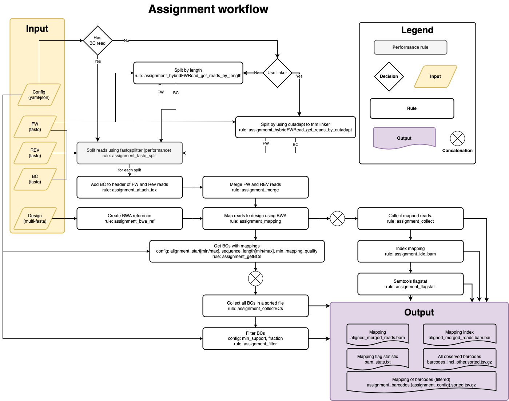

.. _Assignment:

=====================
Assignment
=====================

Input files
===============

Fastq Files
-----------
- 2-3 Fastq files from library association sequencing
- Candidate regulatory sequence (CRS) sequencing, forward and reverse read (paired end)
- (optional) Index read with barcode. BC can also be present at the beginning of the in the forward read followed by a linker.

Design File
-----------
Fasta file of of CRS sequences with unique headers describing each tested sequence

Example file:

.. code-block:: text

    >CRS1
    GACGGGAACGTTTGAGCGAGATCGAGGATAGGAGGAGCGGA
    >CRS2
    GGGCTCTCTTATATTAAGGGGGTGTGTGAACGCTCGCGATT
    >CRS3
    GGCGCGCTTTTTCGAAGAAACCCGCCGGAGAATATAAGGGA
    >CRS4
    TTAGACCGCCCTTTACCCCGAGAAAACTCAGCTACACACTC

Config File
-----------
Multiple mapping strategies are implemented to find the corresponding CRS sequence for each read. The mapping strategy can be chosen in the config file (bwa mem or exact matches). The config file also defines the filtering of the mapping results. The config file is a yaml file.

Example of an assignment file using bwa and the standard filtering:

.. literalinclude:: ../configs/example_assignment_bwa.yml
   :language: yaml

Example of an assignment file using exact matches and the with and non-default filtering of barcodes:

.. literalinclude:: ../configs/example_assignment_exact_lazy.yml
   :language: yaml

Example of an assignment file using exact matches and read 1 with BC, linker and oligo (no seperate BC index read):

.. literalinclude:: ../configs/example_assignment_exact_linker.yml
   :language: yaml

snakemake
============================
 
Options
---------------

With :code:`--help` or :code:`-h` you can see the help message.

Mandatory arguments:
  :\-\-cores:                 
    Use at most N CPU cores/jobs in parallel. If N is omitted or 'all', the limit is set to the number of available CPU cores. In case of cluster/cloud execution, this argument sets the number of total cores used over all jobs (made available to rules via workflow.cores).(default: None)
  :\-\-configfile:
    Specify or overwrite the config file of the workflow (see the docs). Values specified in JSON or YAML format are available in the global config dictionary inside the workflow. Multiple files overwrite each other in the given order. Thereby missing keys in previous config files are extended by following configfiles. Note that this order also includes a config file defined in the workflow definition itself (which will come first). (default: None)
  :\-\-use-conda:             
    **Required to run MPRAsnakeflow.** If defined in the rule, run job in a conda environment. If this flag is not set, the conda directive is ignored. (default: False)
Recommended arguments:
  :\-\-snakefile:             
    You should not need to specify this. By default, Snakemake will search for 'Snakefile', 'snakefile', 'workflow/Snakefile','workflow/snakefile' beneath the current working directory, in this order. Only if you definitely want a different layout, you need to use this parameter. This is very usefull when you want to have the results in a different folder than MPRAsnakeflow is in. (default: None)
Usefull arguments:
  :-n:                      
    Do not execute anything, and display what would be done. If you have a very large workflow, use --dry-run --quiet to just print a summary of the DAG of jobs. (default: False)
  :\-\-touch, -t:             
    Touch output files (mark them up to date without really changing them) instead of running their commands. This is used to pretend that the rules were executed, in order to fool future invocations of snakemake. Fails if a file does not yet exist. Note that this will only touch files that would otherwise be recreated by Snakemake (e.g. because their input files are newer). For enforcing a touch, combine this with --force, --forceall, or --forcerun. Note however that you loose the provenance information when the files have been created in realitiy. Hence, this should be used only as a last resort. (default: False)

Rules
-------------

Rules run by snakemake in the assignment utility.

all
   The overall all rule. Here is defined what final output files are expected.
assignment_attach_idx
    Extract the index sequence and add it to the header.
assignment_bwa_ref
   Create mapping reference for BWA from design file (code:`bwa` mapping approach).
assignment_collect
    Collect mapped reads into one BAM.
assignment_collectBCs
    Get the barcodes.
assignment_fastq_split
   Split the fastq files into n files for parallelisation. N is given by split_read in the configuration file.
assignment_getInputs
   Concat the input fastq files per R1,R2,R3. If only single fastq file is provided a symbolic link is created.
assignment_hybridFWRead_get_reads_by_length
   Get the barcode and read from the FW read using fixed length (when no index BC read is present).
assignmemt_hybridFWRead_get_reads_by_cutadapt
    Get the barcode and read from the FW read using cutadapt (when no index BC read is present). Uses the paired end mode of cutadapt to write the FW and BC read.
assignment_merge
   Merge the FW,REV and BC fastq files into one. Extract the index sequence from the middle and end of an Illumina run. Separates reads for Paired End runs. Merge/Adapter trim reads stored in BAM.
assignment_mapping_bwa
   Map the reads to the reference (code:`bwa` mapping approach).
assignment_idx_bam
   Index the BAM file (code:`bwa` mapping approach).
assignment_flagstat
   Run samtools flagstat. Results are in :code:`results/assignment/<assignment_name>/statistic/assignment/bam_stats.txt`  (code:`bwa` mapping approach).
assignment_mapping_exact_reference
    Create reference to map the exact design  (code:`exact` mapping approach).
rule assignment_mapping_exact
    Map the reads to the reference and sort using exact match (code:`exact` mapping approach).
assignment_getBCs
   Get the barcodes (not filtered). Results are in :code:`results/assignment/<assignment_name>/barcodes_incl_other.sorted.tsv.gz`
assignment_statistic_totalCounts
   Statistic of the total (unfiltered counts). Results are in :code:`results/assignment/<assignment_name>/statistic/total_counts.tsv.gz`
assignment_filter
   Filter the barcodes file based on the config given in the config-file. Results for this run are here :code:`results/assignment/<assignment_name>/assignment_barcodes.<config_name>.sorted.tsv.gz`.
assignment_statistic_assignedCounts
   Statistic of filtered the assigned counts. Result is here :code:`results/assignment/<assignment_name>/statistic/assigned_counts.<config_name>.tsv.gz`.
assignment_statistic_assignment
   Statistic of the filtered assignment.  Result is here :code:`results/assignment/<assignment_name>/statistic/assignment.<config_name>.tsv.gz` and a plot here :code:`results/assignment/<assignment_name>/statistic/assignment.<config_name>.png`.

Output
==========

The output can be found in the folder defined by the option :code:`results/assignment/`. It is structured in folders of the condition as

Files
-------------

File tree of the result folder (names in :code:`< >` can be specified in the config file.)

.. code-block:: text

    ├── assignment
    │   └── <assignment_name>
    │       ├── aligned_merged_reads.bam
    │       ├── aligned_merged_reads.bam.bai
    │       ├── assignment_barcodes.<config_name>.sorted.tsv.gz
    │       ├── barcodes_incl_other.sorted.tsv.gz
    │       ├── reference
    │       │   ├── reference.fa
    │       │   ├── reference.fa.amb
    │       │   ├── reference.fa.ann
    │       │   ├── reference.fa.bwt
    │       │   ├── reference.fa.dict
    │       │   ├── reference.fa.fai
    │       │   ├── reference.fa.pac
    │       │   └── reference.fa.sa
    │       └── statistic
    │           ├── assigned_counts.<config_name>.tsv.gz
    │           ├── assignment
    │           │   └── bam_stats.txt
    │           ├── assignment.<config_name>.png
    │           ├── assignment.<config_name>.tsv.gz
    │           └── total_counts.tsv.gz

total_counts.tsv.gz
    Statistic of BCs mapped to oligos.
assigned_counts.<config_name>.tsv.gz
    Statistic of BCs mapped to oligos after fitering defined by config.
assignment.<config_name>.tsv.gz
    Average/median support of BC per oligo. Oligos with >= 15 BCs.
reference.fa
    Design file.
aligned_merged_reads.bam
    Sorted bamfile for oligo alignment
barcodes_incl_other.sorted.tsv.gz
    Complete list of all barcodes found in mapping file (ambigous and unambigous) with mappings (if possible)
assignment_barcodes.<config_name>.sorted.tsv.gz
    Mapping file of barcodes to sequence. 
assignment.<config_name>.png
    Visualization of number of barcodes mapping to oligo.
bam_stats.txt
    samtools bamstat output.
