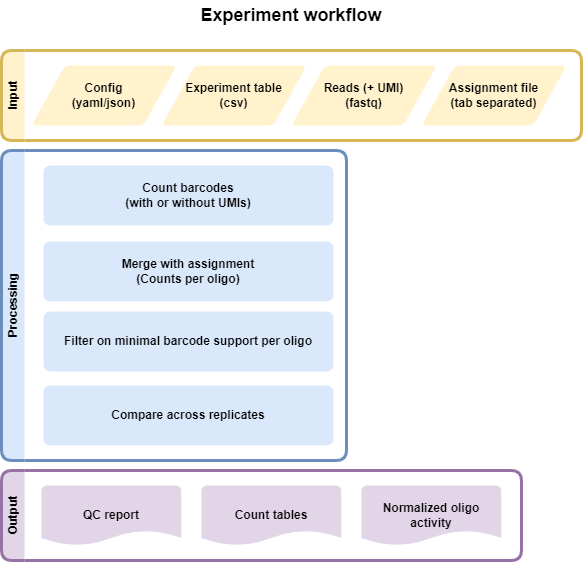

.. _Experiment:

=====================
Experiment (Count)
=====================

Input files
===============

Experiment File
---------------
Comma separated file (CSV) that assigns all fastq files present in a directory to a condidtion and replicate. Each line represents an experiment, which will all be processed in parallel

.. code-block:: text

    Condition,Replicate,DNA_BC_F,DNA_UMI,DNA_BC_R,RNA_BC_F,RNA_UMI,RNA_BC_R
    Condidtion1,1,C1R1_DNA_barcode_F.fastq.gz,C1R1_DNA_barcode_UMI.fastq.gz,C1R1_DNA_barcode_R.fastq.gz,C1R1_RNA_barcode_F.fastq.gz,C1R1_RNA_barcode_UMI.fastq.gz,C1R1_RNA_barcode_R.fastq.gz
    Condidtion1,2,C1R2_DNA_barcode_F.fastq.gz,C1R2_DNA_barcode_UMI.fastq.gz,C1R2_DNA_barcode_R.fastq.gz,C1R2_RNA_barcode_F.fastq.gz,C1R2_RNA_barcode_UMI.fastq.gz,C1R2_RNA_barcode_R.fastq.gz
    Condidtion1,3,C1R3_DNA_barcode_F.fastq.gz,C1R3_DNA_barcode_UMI.fastq.gz,C1R3_DNA_barcode_R.fastq.gz,C1R3_RNA_barcode_F.fastq.gz,C1R3_RNA_barcode_UMI.fastq.gz,C1R3_RNA_barcode_R.fastq.gz
    Condidtion2,1,C2R1_DNA_barcode_F.fastq.gz,C2R1_DNA_barcode_UMI.fastq.gz,C2R1_DNA_barcode_R.fastq.gz,C2R1_RNA_barcode_F.fastq.gz,C2R1_RNA_barcode_UMI.fastq.gz,C2R1_RNA_barcode_R.fastq.gz
    Condidtion2,2,C2R2_DNA_barcode_F.fastq.gz,C2R2_DNA_barcode_UMI.fastq.gz,C2R2_DNA_barcode_R.fastq.gz,C2R2_RNA_barcode_F.fastq.gz,C2R2_RNA_barcode_UMI.fastq.gz,C2R2_RNA_barcode_R.fastq.gz
    Condidtion2,3,C2R3_DNA_barcode_F.fastq.gz,C2R3_DNA_barcode_UMI.fastq.gz,C2R3_DNA_barcode_R.fastq.gz,C2R3_RNA_barcode_F.fastq.gz,C2R3_RNA_barcode_UMI.fastq.gz,C2R3_RNA_barcode_R.fastq.gz
    
Assignment File or configuration
--------------------------------
Tab separated gzipped file with barcode mapped to sequence. Can be generated using the :ref:`Assignment` workflow. Config file must be configured similar to this:

.. code-block:: yaml

    example_assignment:
        type: file
        value: /path/to/your/file.tsv.gz

Example assignment file:

.. code-block:: text

    ATGCGT  CRS1
    GTCGA   CRS2
    CCGTT   CRS3
    CCCCT   CRS4

Another option would be referring to an assignment defined in a config file.

.. code-block:: yaml

    example_assignment:
        type: config
        value: example_config

Label File (Optional)
---------------------
Tab separated file (TSV) of desired labels for each tested sequence

Example file:

.. code-block:: text

    CRS1  Positive_Control
    CRS2  Negative_Control
    CRS3  Test
    CRS4  Positive_Control

.. note:: If you provide a label file, the first column of the label file must exactly match the FASTA file or the files will not merge properly in the pipeline.

snakemake
============================
 
Options
---------------

With :code:`--help` or :code:`-h` you can see the help message.

Mandatory arguments:
  :\-\-cores:                 
    Use at most N CPU cores/jobs in parallel. If N is omitted or 'all', the limit is set to the number of available CPU cores. In case of cluster/cloud execution, this argument sets the number of total cores used over all jobs (made available to rules via workflow.cores).(default: None)
  :\-\-configfile:
    Specify or overwrite the config file of the workflow (see the docs). Values specified in JSON or YAML format are available in the global config dictionary inside the workflow. Multiple files overwrite each other in the given order. Thereby missing keys in previous config files are extended by following configfiles. Note that this order also includes a config file defined in the workflow definition itself (which will come first). (default: None)
  :\-\-sdm:             
    **Required to run MPRAsnakeflow.** : :code:`--sdm conda` or :code:`--sdm apptainer` Uses the defined conda environment per rule. We highly recommend to use apptainer where we build a predefined docker container with all software installewd within it. :code:`--sdm conda` teh conda envs will be installed by the first excecution of the workflow. If this flag is not set, the conda/apptainer directive is ignored. (default: False)
Recommended arguments:
  :\-\-snakefile:             
    You should not need to specify this. By default, Snakemake will search for 'Snakefile', 'snakefile', 'workflow/Snakefile','workflow/snakefile' beneath the current working directory, in this order. Only if you definitely want a different layout, you need to use this parameter. This is very usefull when you want to have the results in a different folder than MPRAsnakeflow is in. (default: None)
Usefull arguments:
  :-n:                      
    Do not execute anything, and display what would be done. If you have a very large workflow, use --dry-run --quiet to just print a summary of the DAG of jobs. (default: False)                                                       
  :\-\-touch, -t:             
    Touch output files (mark them up to date without really changing them) instead of running their commands. This is used to pretend that the rules were executed, in order to fool future invocations of snakemake. Fails if a file does not yet exist. Note that this will only touch files that would otherwise be recreated by Snakemake (e.g. because their input files are newer). For enforcing a touch, combine this with --force, --forceall, or --forcerun. Note however that you loose the provenance information when the files have been created in realitiy. Hence, this should be used only as a last resort. (default: False)

Rules
---------

Rules run by snakemake in the assignment utility. Some rules will be run only if certain options used and are marked below.

create_BAM or create_BAM_noUMI (if no UMI sequence)
  creates a bamfile of barcode and UMI sequences

raw_counts
  creates a table of counts for each barcode (where UMIs, if present, are deduplicated)
  
filter_counts
  Remove barcodes that are not the appropriate length

final_counts
  Record overrepresended UMIs and final count table

dna_rna_merge_counts or dna_rna_mpranalyze_merge
  Merge RNA/DNA count matrices per barcode

final_merge (MPRAnalyze option only)
  Merge all DNA/RNA counts into one file
  
final_label (MPRAnalyze option only)
  Label the barcodes 
  
generate_mpranalyze_inputs (MPRAnalyze option only)
  Generate inputs for MPRAnalyze, counts tables and annotation tables for rna/dna 
  
dna_rna_merge
  Merge each DNA and RNA file label with sequence and insert and normalize
  
calc_correlations
  Calculate correlations between Replicates
  
make_master_tables
  Create tables of each CRS normalized across replicates

  
Output
==========

The output can be found in the folder defined by the option :code:`results/experiments/`. It is structured in folders of the condition as

Files
-------------
Once the pipline is finished running then all the output files can be seen in the results folder. This pipline also generates a qc report. 
For more details, refer to the `HTML documentation <../../qc_report.HepG2.MPRAworkshop.tutorialConfig.html>`_.

File tree

.. code-block:: text

    experimet_name
      |-Condition
        |-allreps.tsv
        |-average_allreps.tsv
        |-HepG2_1_2_correlation.txt
        |-HepG2_1_2_DNA_pairwise.png
        |-HepG2_1_2_Ratio_pairwise.png
        |-HepG2_1_2_RNA_pairwise.png
        |-HepG2_barcodesPerInsert.png
            |-Reps
                |-HepG2_1_counts.tsv
                |-HepG2_1_counts.tsv.gz
                |-HepG2_1_DNA_counts_full.tsv
                |-HepG2_1_DNA_counts_full_samplingN.tsv
                |-HepG2_1_DNA_raw_counts.tsv.gz  
                |-HepG2_1_RNA_filtered_counts.tsv.gz
                |-HepG2_1_DNA_filtered_counts.tsv.gz
                |-HepG2_1_RNA_counts.tsv
                |-HepG2_1_RNA_raw_counts.tsv.gz

.. todo:: This is not the correct file tree for the experiment workflow

Files for each Condition
------------------------
allreps.tsv
  TSV of normalized DNA and RNA count, ratio, log2ratio, and number of observed barcodes for each condition, replicate, of every CRS
average_allreps.tsv
  mean ratio, log2 ratio, and observed barcodes per condidition normalized for all replicates
HepG2_1_2_correlation.txt
  correlation values for a condition and 2 replicates (ie: HepG2 replicate 1 vs replicate 2)
HepG2_1_2_DNA_pairwise.png
  Correlation plot of DNA counts condition vs two reps (ie: HepG2 replicate 1 vs replicate 2)
HepG2_1_2_Ratio_pairwise.png
  Correlation plot of normalized log2(RNA/DNA) condition vs two reps (ie: HepG2 replicate 1 vs replicate 2)
HepG2_1_2_RNA_pairwise.png
  Correlation plot of RNA counts condition vs two reps (ie: HepG2 replicate 1 vs replicate 2)
HepG2_barcodesPerInsert.png
  Histogram of number of barcodes detected per CRS
HepG2_group_barcodesPerInsert_box.png
  Boxplot of CRS normalized per insert, grouped by labels

.. todo:: These are not the correct files for each condition in the experiment workflow

Files for each replicate in each condition
-------------------------------------------
HepG2_1_counts.tsv  
  mean ratio, log2 ratio, and observed barcodes per condidition for each replicate
HepG2_1_counts.tsv.gz
  table of barcodes with DNA counts and RNA counts
HepG2_1_DNA_counts_full.tsv              
  table of barcodes with DNA counts
HepG2_1_DNA_counts_full_samplingN.tsv              
  table of barcodes with DNA counts with adjusted sampling.
HepG2_1_DNA_raw_counts.tsv.gz  
  table of barcodes, UMI, and DNA counts raw
HepG2_1_DNA_filtered_counts.tsv.gz  
  table of barcodes, UMI, and DNA counts raw, filtered for barcodes of correct length
HepG2_1_RNA_counts.tsv
  table of barcodes with RNA counts
HepG2_1_RNA_raw_counts.tsv.gz
  table of barcodes, UMI, and RNA counts raw
HepG2_1_RNA_filtered_counts.tsv.gz
  table of barcodes, UMI, and DNA counts raw, filtered for barcodes of correct length

.. todo:: These are not the correct files for the experiment workflow
